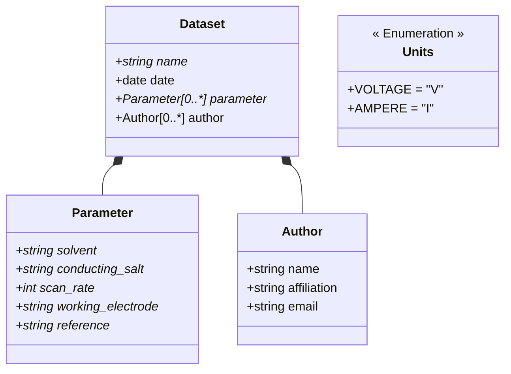

```mermaid
classDiagram
    Dataset *-- Parameter
    Dataset *-- Author
    
    class Dataset {
        +string name*
        +date date
        +Parameter[0..*] parameter*
        +Author[0..*] author
    }
    
    class Author {
        +string name
        +string affiliation
        +string email
    }
    
    class Parameter {
        +string solvent*
        +string conducting_salt*
        +int scan_rate*
        +string working_electrode*
        +string reference*
    }
    
    class Units {
        << Enumeration >>
        +VOLTAGE = "V"
        +AMPERE = "I"
    }
    
```