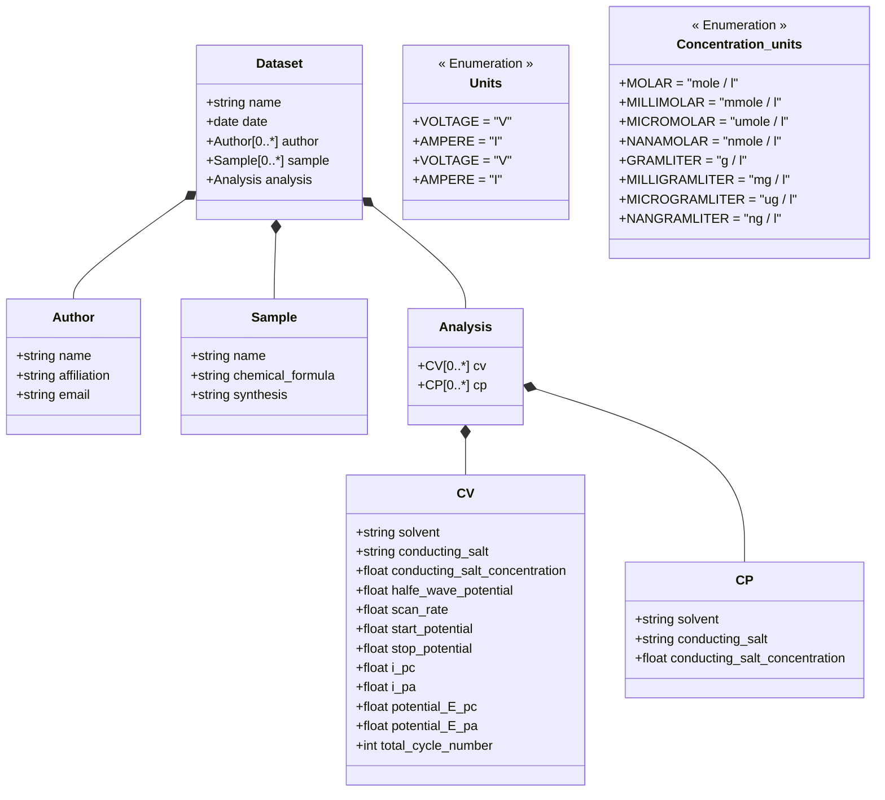

```mermaid
classDiagram
    Dataset *-- Author
    Dataset *-- Sample
    Dataset *-- Analysis
    Analysis *-- CV
    Analysis *-- CP
    
    class Dataset {
        +string name
        +date date
        +Author[0..*] author
        +Sample[0..*] sample
        +Analysis analysis
    }
    
    class Sample {
        +string name
        +string chemical_formula
        +string synthesis
    }
    
    class Analysis {
        +CV[0..*] cv
        +CP[0..*] cp
    }
    
    class CP {
        +string solvent
        +string conducting_salt
        +float conducting_salt_concentration
    }
    
    class CV {
        +string solvent
        +string conducting_salt
        +float conducting_salt_concentration
        +float halfe_wave_potential
        +float scan_rate
        +float start_potential
        +float stop_potential
        +float i_pc
        +float i_pa
        +float potential_E_pc
        +float potential_E_pa
        +int total_cycle_number
    }
    
    class Author {
        +string name
        +string affiliation
        +string email
    }
    
    class Units {
        << Enumeration >>
        +VOLTAGE = "V"
        +AMPERE = "I"
    }
    
    class Units {
        << Enumeration >>
        +VOLTAGE = "V"
        +AMPERE = "I"
    }
    
    class Concentration_units {
        << Enumeration >>
        +MOLAR = "mole / l"
        +MILLIMOLAR = "mmole / l"
        +MICROMOLAR = "umole / l"
        +NANAMOLAR = "nmole / l"
        +GRAMLITER = "g / l"
        +MILLIGRAMLITER = "mg / l"
        +MICROGRAMLITER = "ug / l"
        +NANGRAMLITER = "ng / l"
    }
    
```