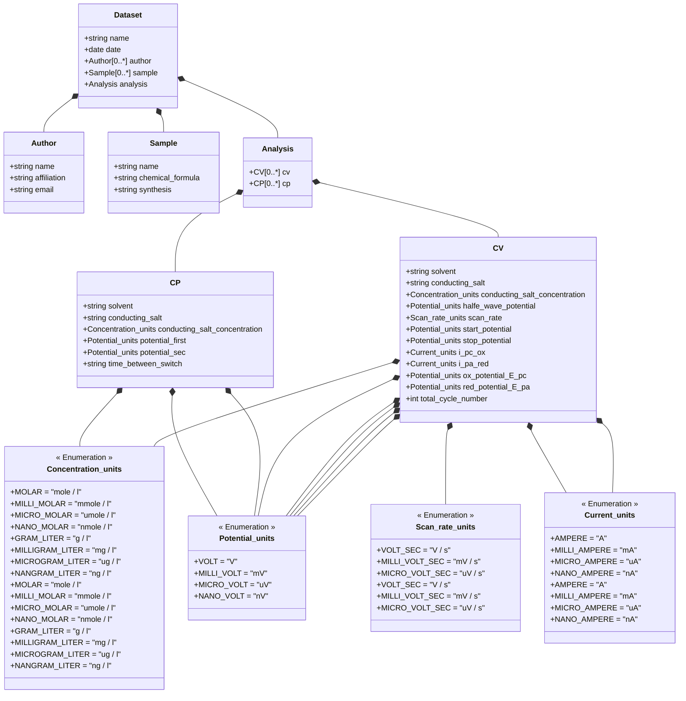

```mermaid
classDiagram
    Dataset *-- Author
    Dataset *-- Sample
    Dataset *-- Analysis
    Analysis *-- CV
    Analysis *-- CP
    CP *-- Concentration_units
    CP *-- Potential_units
    CP *-- Potential_units
    CV *-- Concentration_units
    CV *-- Potential_units
    CV *-- Scan_rate_units
    CV *-- Potential_units
    CV *-- Potential_units
    CV *-- Current_units
    CV *-- Current_units
    CV *-- Potential_units
    CV *-- Potential_units
    
    class Dataset {
        +string name
        +date date
        +Author[0..*] author
        +Sample[0..*] sample
        +Analysis analysis
    }
    
    class Sample {
        +string name
        +string chemical_formula
        +string synthesis
    }
    
    class Analysis {
        +CV[0..*] cv
        +CP[0..*] cp
    }
    
    class CP {
        +string solvent
        +string conducting_salt
        +Concentration_units conducting_salt_concentration
        +Potential_units potential_first
        +Potential_units potential_sec
        +string time_between_switch
    }
    
    class CV {
        +string solvent
        +string conducting_salt
        +Concentration_units conducting_salt_concentration
        +Potential_units halfe_wave_potential
        +Scan_rate_units scan_rate
        +Potential_units start_potential
        +Potential_units stop_potential
        +Current_units i_pc_ox
        +Current_units i_pa_red
        +Potential_units ox_potential_E_pc
        +Potential_units red_potential_E_pa
        +int total_cycle_number
    }
    
    class Author {
        +string name
        +string affiliation
        +string email
    }
    
    class Concentration_units {
        << Enumeration >>
        +MOLAR = "mole / l"
        +MILLI_MOLAR = "mmole / l"
        +MICRO_MOLAR = "umole / l"
        +NANO_MOLAR = "nmole / l"
        +GRAM_LITER = "g / l"
        +MILLIGRAM_LITER = "mg / l"
        +MICROGRAM_LITER = "ug / l"
        +NANGRAM_LITER = "ng / l"
    }
    
    class Concentration_units {
        << Enumeration >>
        +MOLAR = "mole / l"
        +MILLI_MOLAR = "mmole / l"
        +MICRO_MOLAR = "umole / l"
        +NANO_MOLAR = "nmole / l"
        +GRAM_LITER = "g / l"
        +MILLIGRAM_LITER = "mg / l"
        +MICROGRAM_LITER = "ug / l"
        +NANGRAM_LITER = "ng / l"
    }
    
    class Scan_rate_units {
        << Enumeration >>
        +VOLT_SEC = "V / s"
        +MILLI_VOLT_SEC = "mV / s"
        +MICRO_VOLT_SEC = "uV / s"
    }
    
    class Scan_rate_units {
        << Enumeration >>
        +VOLT_SEC = "V / s"
        +MILLI_VOLT_SEC = "mV / s"
        +MICRO_VOLT_SEC = "uV / s"
    }
    
    class Current_units {
        << Enumeration >>
        +AMPERE = "A"
        +MILLI_AMPERE = "mA"
        +MICRO_AMPERE = "uA"
        +NANO_AMPERE = "nA"
    }
    
    class Current_units {
        << Enumeration >>
        +AMPERE = "A"
        +MILLI_AMPERE = "mA"
        +MICRO_AMPERE = "uA"
        +NANO_AMPERE = "nA"
    }
    
    class Potential_units {
        << Enumeration >>
        +VOLT = "V"
        +MILLI_VOLT = "mV"
        +MICRO_VOLT = "uV"
        +NANO_VOLT = "nV"
    }
    
```