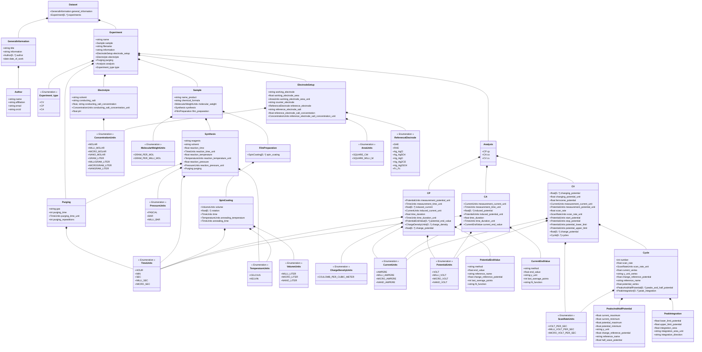

```mermaid
classDiagram
    Dataset *-- GeneralInformation
    Dataset *-- Experiment
    GeneralInformation *-- Author
    Experiment *-- Experiment_type
    Experiment *-- Purging
    Experiment *-- Electrolyte
    Experiment *-- Sample
    Experiment *-- Analysis
    Experiment *-- ElectrodeSetup
    Purging *-- TimeUnits
    Electrolyte *-- ConcentrationUnits
    Sample *-- MolecularWeightUnits
    Sample *-- Synthesis
    Sample *-- FilmPreparation
    Synthesis *-- PressureUnits
    Synthesis *-- TemperatureUnits
    Synthesis *-- TimeUnits
    Synthesis *-- Purging
    FilmPreparation *-- SpinCoating
    SpinCoating *-- TemperatureUnits
    SpinCoating *-- VolumeUnits
    SpinCoating *-- TimeUnits
    Analysis *-- CP
    Analysis *-- CA
    Analysis *-- CV
    CP *-- ChargeDensityUnits
    CP *-- TimeUnits
    CP *-- CurrentUnits
    CP *-- PotentialUnits
    CP *-- PotentialEndValue
    CA *-- TimeUnits
    CA *-- CurrentUnits
    CA *-- PotentialUnits
    CA *-- CurrentEndValue
    CV *-- ScanRateUnits
    CV *-- CurrentUnits
    CV *-- PotentialUnits
    CV *-- Cycle
    Cycle *-- ScanRateUnits
    Cycle *-- PeaksAndHalfPotential
    Cycle *-- PeakIntegration
    ElectrodeSetup *-- ConcentrationUnits
    ElectrodeSetup *-- AreaUnits
    ElectrodeSetup *-- ReferenceElectrode
    
    class Dataset {
        +GeneralInformation general_information
        +Experiment[0..*] experiments
    }
    
    class GeneralInformation {
        +string title
        +string information
        +Author[0..*] author
        +date date_of_work
    }
    
    class Experiment {
        +string name
        +Sample sample
        +string filename
        +string information
        +ElectrodeSetup electrode_setup
        +Electrolyte electrolyte
        +Purging purging
        +Analysis analysis
        +Experiment_type type
    }
    
    class Purging {
        +string gas
        +int purging_time
        +TimeUnits purging_time_unit
        +int purging_repeatitions
    }
    
    class Electrolyte {
        +string solvent
        +string conducting_salt
        +float, string conducting_salt_concentration
        +ConcentrationUnits conducting_salt_concentration_unit
        +float pH
    }
    
    class Sample {
        +string name_product
        +string chemical_formula
        +MolecularWeightUnits molecular_weight
        +Synthesis synthesis
        +FilmPreparation film_preparation
    }
    
    class Synthesis {
        +string reagents
        +string solvent
        +float reaction_time
        +TimeUnits reaction_time_unit
        +float reaction_temperature
        +TemperatureUnits reaction_temperature_unit
        +float reaction_pressure
        +PressureUnits reaction_pressure_unit
        +Purging purging
    }
    
    class FilmPreparation {
        +SpinCoating[0..*] spin_coating
    }
    
    class SpinCoating {
        +VolumeUnits volume
        +float[0..*] rotation
        +TimeUnits time
        +TemperatureUnits annealing_temperature
        +TimeUnits annealing_time
    }
    
    class Analysis {
        +CP cp
        +CA ca
        +CV cv
    }
    
    class CP {
        +PotentialUnits measurement_potential_unit
        +TimeUnits measurement_time_unit
        +float[0..*] induced_current
        +CurrentUnits induced_current_unit
        +float time_duration
        +TimeUnits time_duration_unit
        +PotentialEndValue[0..*] potential_end_value
        +ChargeDensityUnits[0..*] charge_density
        +float[0..*] change_potential
    }
    
    class PotentialEndValue {
        +string method
        +float end_value
        +string reference_name
        +float change_reference_potential
        +int last_average_points
        +string fit_function
    }
    
    class CA {
        +CurrentUnits measurement_current_unit
        +TimeUnits measurement_time_unit
        +float[0..*] induced_potential
        +PotentialUnits induced_potential_unit
        +float time_duration
        +TimeUnits time_duration_unit
        +CurrentEndValue current_end_value
    }
    
    class CurrentEndValue {
        +string method
        +float end_value
        +string y_unit
        +int last_average_points
        +string fit_function
    }
    
    class CV {
        +float[0..*] changing_potential
        +float changing_potential_unit
        +float ferrocene_potential
        +CurrentUnits measurement_current_unit
        +PotentialUnits measurement_potential_unit
        +float scan_rate
        +ScanRateUnits scan_rate_unit
        +PotentialUnits start_potential
        +PotentialUnits stop_potential
        +PotentialUnits potential_lower_limit
        +PotentialUnits potential_upper_limit
        +float[0..*] change_potential
        +Cycle[0..*] cycles
    }
    
    class Cycle {
        +int number
        +float scan_rate
        +ScanRateUnits scan_rate_unit
        +float current_vertex
        +string y_unit_vertex
        +float change_reference_potential
        +string reference_name
        +float potential_vertex
        +PeaksAndHalfPotential[0..*] peaks_and_half_potential
        +PeakIntegration[0..*] peak_integration
    }
    
    class PeaksAndHalfPotential {
        +float current_maximum
        +float current_minimum
        +float potential_maximum
        +float potential_minimum
        +string y_unit
        +float change_reference_potential
        +string reference_name
        +float half_wave_potential
    }
    
    class PeakIntegration {
        +float lower_limit_potential
        +float upper_limit_potential
        +float integration_area
        +string integration_area_unit
        +string integration_direction
    }
    
    class ElectrodeSetup {
        +string working_electrode
        +float working_electrode_area
        +AreaUnits working_electrode_area_unit
        +string counter_electrode
        +ReferenceElectrode reference_electrode
        +string reference_electrode_salt
        +float reference_electrode_salt_concentration
        +ConcentrationUnits reference_electrode_salt_concentration_unit
    }
    
    class Author {
        +string name
        +string affiliation
        +string email
        +string orcid
    }
    
    class Experiment_type {
        << Enumeration >>
        +CV
        +CP
        +CA
    }
    
    class ChargeDensityUnits {
        << Enumeration >>
        +COULOMB_PER_CUBIC_METER
    }
    
    class PressureUnits {
        << Enumeration >>
        +PASCAL
        +BAR
        +MILLI_BAR
    }
    
    class MolecularWeightUnits {
        << Enumeration >>
        +GRAM_PER_MOL
        +GRAM_PER_MILLI_MOL
    }
    
    class TemperatureUnits {
        << Enumeration >>
        +CELCIUS
        +KELVIN
    }
    
    class VolumeUnits {
        << Enumeration >>
        +MILLI_LITER
        +MICRO_LITER
        +NANO_LITER
    }
    
    class TimeUnits {
        << Enumeration >>
        +HOUR
        +MIN
        +SEC
        +MILLI_SEC
        +MICRO_SEC
    }
    
    class ConcentrationUnits {
        << Enumeration >>
        +MOLAR
        +MILLI_MOLAR
        +MICRO_MOLAR
        +NANO_MOLAR
        +GRAM_LITER
        +MILLIGRAM_LITER
        +MICROGRAM_LITER
        +NANGRAM_LITER
    }
    
    class ScanRateUnits {
        << Enumeration >>
        +VOLT_PER_SEC
        +MILLI_VOLT_PER_SEC
        +MICRO_VOLT_PER_SEC
    }
    
    class CurrentUnits {
        << Enumeration >>
        +AMPERE
        +MILLI_AMPERE
        +MICRO_AMPERE
        +NANO_AMPERE
    }
    
    class PotentialUnits {
        << Enumeration >>
        +VOLT
        +MILLI_VOLT
        +MICRO_VOLT
        +NANO_VOLT
    }
    
    class AreaUnits {
        << Enumeration >>
        +SQUARE_CM
        +SQUARE_MILLI_M
    }
    
    class ReferenceElectrode {
        << Enumeration >>
        +SHE
        +RHE
        +Ag_AgCl
        +Ag_AgSO4
        +Hg_HgO
        +Hg_Hg2Cl2
        +Hg_Hg2SO4
        +Fc_Fc
    }
    
```