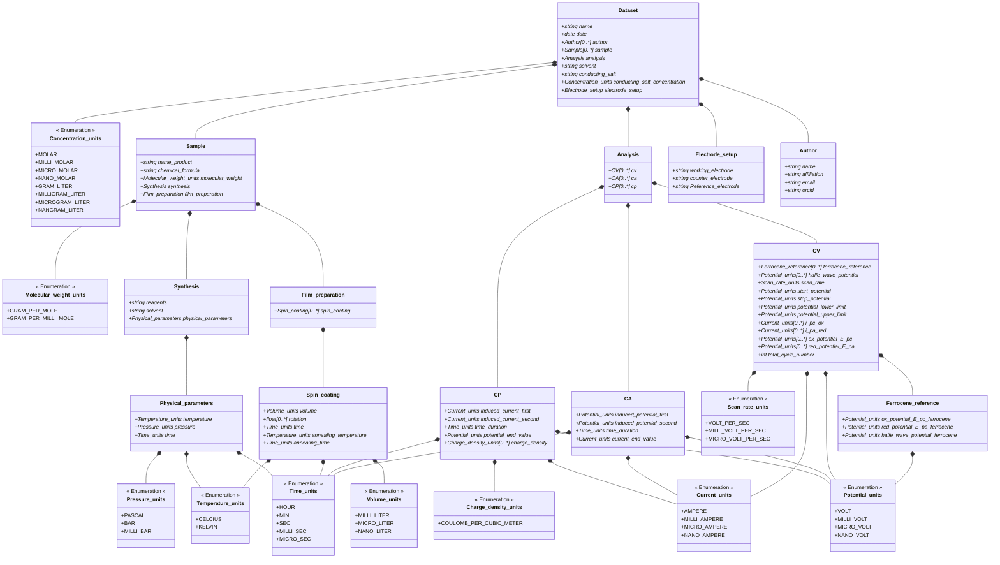

```mermaid
classDiagram
    Dataset *-- Concentration_units
    Dataset *-- Sample
    Dataset *-- Analysis
    Dataset *-- Electrode_setup
    Dataset *-- Author
    Sample *-- Molecular_weight_units
    Sample *-- Synthesis
    Sample *-- Film_preparation
    Synthesis *-- Physical_parameters
    Physical_parameters *-- Pressure_units
    Physical_parameters *-- Temperature_units
    Physical_parameters *-- Time_units
    Film_preparation *-- Spin_coating
    Spin_coating *-- Temperature_units
    Spin_coating *-- Volume_units
    Spin_coating *-- Time_units
    Analysis *-- CP
    Analysis *-- CA
    Analysis *-- CV
    CP *-- Charge_density_units
    CP *-- Time_units
    CP *-- Current_units
    CP *-- Potential_units
    CA *-- Time_units
    CA *-- Current_units
    CA *-- Potential_units
    CV *-- Scan_rate_units
    CV *-- Current_units
    CV *-- Potential_units
    CV *-- Ferrocene_reference
    Ferrocene_reference *-- Potential_units
    
    class Dataset {
        +string name*
        +date date*
        +Author[0..*] author*
        +Sample[0..*] sample*
        +Analysis analysis*
        +string solvent*
        +string conducting_salt*
        +Concentration_units conducting_salt_concentration*
        +Electrode_setup electrode_setup*
    }
    
    class Sample {
        +string name_product*
        +string chemical_formula*
        +Molecular_weight_units molecular_weight*
        +Synthesis synthesis*
        +Film_preparation film_preparation*
    }
    
    class Synthesis {
        +string reagents*
        +string solvent*
        +Physical_parameters physical_parameters*
    }
    
    class Physical_parameters {
        +Temperature_units temperature*
        +Pressure_units pressure*
        +Time_units time*
    }
    
    class Film_preparation {
        +Spin_coating[0..*] spin_coating*
    }
    
    class Spin_coating {
        +Volume_units volume*
        +float[0..*] rotation*
        +Time_units time*
        +Temperature_units annealing_temperature*
        +Time_units annealing_time*
    }
    
    class Analysis {
        +CV[0..*] cv*
        +CA[0..*] ca*
        +CP[0..*] cp*
    }
    
    class CP {
        +Current_units induced_current_first*
        +Current_units induced_current_second*
        +Time_units time_duration*
        +Potential_units potential_end_value*
        +Charge_density_units[0..*] charge_density*
    }
    
    class CA {
        +Potential_units induced_potential_first*
        +Potential_units induced_potential_second*
        +Time_units time_duration*
        +Current_units current_end_value*
    }
    
    class CV {
        +Ferrocene_reference[0..*] ferrocene_reference*
        +Potential_units[0..*] halfe_wave_potential*
        +Scan_rate_units scan_rate*
        +Potential_units start_potential*
        +Potential_units stop_potential*
        +Potential_units potential_lower_limit*
        +Potential_units potential_upper_limit*
        +Current_units[0..*] i_pc_ox*
        +Current_units[0..*] i_pa_red*
        +Potential_units[0..*] ox_potential_E_pc*
        +Potential_units[0..*] red_potential_E_pa*
        +int total_cycle_number*
    }
    
    class Ferrocene_reference {
        +Potential_units ox_potential_E_pc_ferrocene*
        +Potential_units red_potential_E_pa_ferrocene*
        +Potential_units halfe_wave_potential_ferrocene*
    }
    
    class Electrode_setup {
        +string working_electrode*
        +string counter_electrode*
        +string Reference_electrode*
    }
    
    class Author {
        +string name*
        +string affiliation*
        +string email*
        +string orcid*
    }
    
    class Charge_density_units {
        << Enumeration >>
        +COULOMB_PER_CUBIC_METER
    }
    
    class Pressure_units {
        << Enumeration >>
        +PASCAL
        +BAR
        +MILLI_BAR
    }
    
    class Molecular_weight_units {
        << Enumeration >>
        +GRAM_PER_MOLE
        +GRAM_PER_MILLI_MOLE
    }
    
    class Temperature_units {
        << Enumeration >>
        +CELCIUS
        +KELVIN
    }
    
    class Volume_units {
        << Enumeration >>
        +MILLI_LITER
        +MICRO_LITER
        +NANO_LITER
    }
    
    class Time_units {
        << Enumeration >>
        +HOUR
        +MIN
        +SEC
        +MILLI_SEC
        +MICRO_SEC
    }
    
    class Concentration_units {
        << Enumeration >>
        +MOLAR
        +MILLI_MOLAR
        +MICRO_MOLAR
        +NANO_MOLAR
        +GRAM_LITER
        +MILLIGRAM_LITER
        +MICROGRAM_LITER
        +NANGRAM_LITER
    }
    
    class Scan_rate_units {
        << Enumeration >>
        +VOLT_PER_SEC
        +MILLI_VOLT_PER_SEC
        +MICRO_VOLT_PER_SEC
    }
    
    class Current_units {
        << Enumeration >>
        +AMPERE
        +MILLI_AMPERE
        +MICRO_AMPERE
        +NANO_AMPERE
    }
    
    class Potential_units {
        << Enumeration >>
        +VOLT
        +MILLI_VOLT
        +MICRO_VOLT
        +NANO_VOLT
    }
    
```