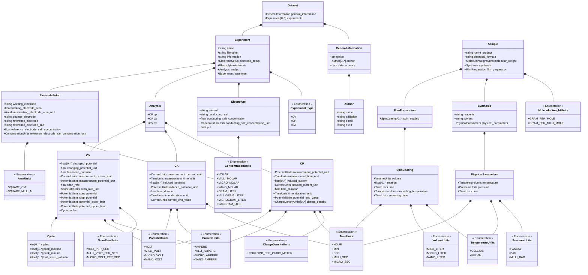

```mermaid
classDiagram
    Dataset *-- GeneralInformation
    Dataset *-- Experiment
    GeneralInformation *-- Author
    Experiment *-- Experiment_type
    Experiment *-- Electrolyte
    Experiment *-- Analysis
    Experiment *-- ElectrodeSetup
    Electrolyte *-- ConcentrationUnits
    Sample *-- MolecularWeightUnits
    Sample *-- Synthesis
    Sample *-- FilmPreparation
    Synthesis *-- PhysicalParameters
    PhysicalParameters *-- PressureUnits
    PhysicalParameters *-- TemperatureUnits
    PhysicalParameters *-- TimeUnits
    FilmPreparation *-- SpinCoating
    SpinCoating *-- TemperatureUnits
    SpinCoating *-- VolumeUnits
    SpinCoating *-- TimeUnits
    Analysis *-- CP
    Analysis *-- CA
    Analysis *-- CV
    CP *-- ChargeDensityUnits
    CP *-- TimeUnits
    CP *-- CurrentUnits
    CP *-- PotentialUnits
    CA *-- TimeUnits
    CA *-- CurrentUnits
    CA *-- PotentialUnits
    CV *-- ScanRateUnits
    CV *-- CurrentUnits
    CV *-- PotentialUnits
    CV *-- Cycle
    ElectrodeSetup *-- ConcentrationUnits
    ElectrodeSetup *-- AreaUnits
    
    class Dataset {
        +GeneralInformation general_information
        +Experiment[0..*] experiments
    }
    
    class GeneralInformation {
        +string title
        +Author[0..*] author
        +date date_of_work
    }
    
    class Experiment {
        +string name
        +string filename
        +string information
        +ElectrodeSetup electrode_setup
        +Electrolyte electrolyte
        +Analysis analysis
        +Experiment_type type
    }
    
    class Electrolyte {
        +string solvent
        +string conducting_salt
        +float conducting_salt_concentration
        +ConcentrationUnits conducting_salt_concentration_unit
        +float pH
    }
    
    class Sample {
        +string name_product
        +string chemical_formula
        +MolecularWeightUnits molecular_weight
        +Synthesis synthesis
        +FilmPreparation film_preparation
    }
    
    class Synthesis {
        +string reagents
        +string solvent
        +PhysicalParameters physical_parameters
    }
    
    class PhysicalParameters {
        +TemperatureUnits temperature
        +PressureUnits pressure
        +TimeUnits time
    }
    
    class FilmPreparation {
        +SpinCoating[0..*] spin_coating
    }
    
    class SpinCoating {
        +VolumeUnits volume
        +float[0..*] rotation
        +TimeUnits time
        +TemperatureUnits annealing_temperature
        +TimeUnits annealing_time
    }
    
    class Analysis {
        +CP cp
        +CA ca
        +CV cv
    }
    
    class CP {
        +PotentialUnits measurement_potential_unit
        +TimeUnits measurement_time_unit
        +float[0..*] induced_current
        +CurrentUnits induced_current_unit
        +float time_duration
        +TimeUnits time_duration_unit
        +PotentialUnits potential_end_value
        +ChargeDensityUnits[0..*] charge_density
    }
    
    class CA {
        +CurrentUnits measurement_current_unit
        +TimeUnits measurement_time_unit
        +float[0..*] induced_potential
        +PotentialUnits induced_potential_unit
        +float time_duration
        +TimeUnits time_duration_unit
        +CurrentUnits current_end_value
    }
    
    class CV {
        +float[0..*] changing_potential
        +float changing_potential_unit
        +float ferrocene_potential
        +CurrentUnits measurement_current_unit
        +PotentialUnits measurement_potential_unit
        +float scan_rate
        +ScanRateUnits scan_rate_unit
        +PotentialUnits start_potential
        +PotentialUnits stop_potential
        +PotentialUnits potential_lower_limit
        +PotentialUnits potential_upper_limit
        +Cycle cycles
    }
    
    class Cycle {
        +int[0..*] cycles
        +float[0..*] peak_maxima
        +float[0..*] peak_minima
        +float[0..*] half_wave_potential
    }
    
    class ElectrodeSetup {
        +string working_electrode
        +float working_electrode_area
        +AreaUnits working_electrode_area_unit
        +string counter_electrode
        +string reference_electrode
        +string reference_electrode_salt
        +float reference_electrode_salt_concentration
        +ConcentrationUnits reference_electrode_salt_concentration_unit
    }
    
    class Author {
        +string name
        +string affiliation
        +string email
        +string orcid
    }
    
    class Experiment_type {
        << Enumeration >>
        +CV
        +CP
        +CA
    }
    
    class ChargeDensityUnits {
        << Enumeration >>
        +COULOMB_PER_CUBIC_METER
    }
    
    class PressureUnits {
        << Enumeration >>
        +PASCAL
        +BAR
        +MILLI_BAR
    }
    
    class MolecularWeightUnits {
        << Enumeration >>
        +GRAM_PER_MOLE
        +GRAM_PER_MILLI_MOLE
    }
    
    class TemperatureUnits {
        << Enumeration >>
        +CELCIUS
        +KELVIN
    }
    
    class VolumeUnits {
        << Enumeration >>
        +MILLI_LITER
        +MICRO_LITER
        +NANO_LITER
    }
    
    class TimeUnits {
        << Enumeration >>
        +HOUR
        +MIN
        +SEC
        +MILLI_SEC
        +MICRO_SEC
    }
    
    class ConcentrationUnits {
        << Enumeration >>
        +MOLAR
        +MILLI_MOLAR
        +MICRO_MOLAR
        +NANO_MOLAR
        +GRAM_LITER
        +MILLIGRAM_LITER
        +MICROGRAM_LITER
        +NANGRAM_LITER
    }
    
    class ScanRateUnits {
        << Enumeration >>
        +VOLT_PER_SEC
        +MILLI_VOLT_PER_SEC
        +MICRO_VOLT_PER_SEC
    }
    
    class CurrentUnits {
        << Enumeration >>
        +AMPERE
        +MILLI_AMPERE
        +MICRO_AMPERE
        +NANO_AMPERE
    }
    
    class PotentialUnits {
        << Enumeration >>
        +VOLT
        +MILLI_VOLT
        +MICRO_VOLT
        +NANO_VOLT
    }
    
    class AreaUnits {
        << Enumeration >>
        +SQUARE_CM
        +SQUARE_MILLI_M
    }
    
```