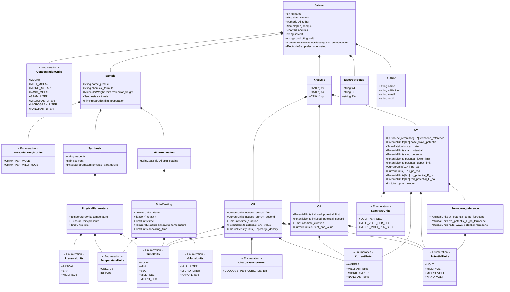

```mermaid
classDiagram
    Dataset *-- ConcentrationUnits
    Dataset *-- Sample
    Dataset *-- Analysis
    Dataset *-- ElectrodeSetup
    Dataset *-- Author
    Sample *-- MolecularWeightUnits
    Sample *-- Synthesis
    Sample *-- FilmPreparation
    Synthesis *-- PhysicalParameters
    PhysicalParameters *-- PressureUnits
    PhysicalParameters *-- TemperatureUnits
    PhysicalParameters *-- TimeUnits
    FilmPreparation *-- SpinCoating
    SpinCoating *-- TemperatureUnits
    SpinCoating *-- VolumeUnits
    SpinCoating *-- TimeUnits
    Analysis *-- CP
    Analysis *-- CA
    Analysis *-- CV
    CP *-- ChargeDensityUnits
    CP *-- TimeUnits
    CP *-- CurrentUnits
    CP *-- PotentialUnits
    CA *-- TimeUnits
    CA *-- CurrentUnits
    CA *-- PotentialUnits
    CV *-- ScanRateUnits
    CV *-- CurrentUnits
    CV *-- PotentialUnits
    CV *-- Ferrocene_reference
    Ferrocene_reference *-- PotentialUnits
    
    class Dataset {
        +string name
        +date date_created
        +Author[0..*] author
        +Sample[0..*] sample
        +Analysis analysis
        +string solvent
        +string conducting_salt
        +ConcentrationUnits conducting_salt_concentration
        +ElectrodeSetup electrode_setup
    }
    
    class Sample {
        +string name_product
        +string chemical_formula
        +MolecularWeightUnits molecular_weight
        +Synthesis synthesis
        +FilmPreparation film_preparation
    }
    
    class Synthesis {
        +string reagents
        +string solvent
        +PhysicalParameters physical_parameters
    }
    
    class PhysicalParameters {
        +TemperatureUnits temperature
        +PressureUnits pressure
        +TimeUnits time
    }
    
    class FilmPreparation {
        +SpinCoating[0..*] spin_coating
    }
    
    class SpinCoating {
        +VolumeUnits volume
        +float[0..*] rotation
        +TimeUnits time
        +TemperatureUnits annealing_temperature
        +TimeUnits annealing_time
    }
    
    class Analysis {
        +CV[0..*] cv
        +CA[0..*] ca
        +CP[0..*] cp
    }
    
    class CP {
        +CurrentUnits induced_current_first
        +CurrentUnits induced_current_second
        +TimeUnits time_duration
        +PotentialUnits potential_end_value
        +ChargeDensityUnits[0..*] charge_density
    }
    
    class CA {
        +PotentialUnits induced_potential_first
        +PotentialUnits induced_potential_second
        +TimeUnits time_duration
        +CurrentUnits current_end_value
    }
    
    class CV {
        +Ferrocene_reference[0..*] ferrocene_reference
        +PotentialUnits[0..*] halfe_wave_potential
        +ScanRateUnits scan_rate
        +PotentialUnits start_potential
        +PotentialUnits stop_potential
        +PotentialUnits potential_lower_limit
        +PotentialUnits potential_upper_limit
        +CurrentUnits[0..*] i_pc_ox
        +CurrentUnits[0..*] i_pa_red
        +PotentialUnits[0..*] ox_potential_E_pc
        +PotentialUnits[0..*] red_potential_E_pa
        +int total_cycle_number
    }
    
    class Ferrocene_reference {
        +PotentialUnits ox_potential_E_pc_ferrocene
        +PotentialUnits red_potential_E_pa_ferrocene
        +PotentialUnits halfe_wave_potential_ferrocene
    }
    
    class ElectrodeSetup {
        +string WE
        +string CE
        +string RW
    }
    
    class Author {
        +string name
        +string affiliation
        +string email
        +string orcid
    }
    
    class ChargeDensityUnits {
        << Enumeration >>
        +COULOMB_PER_CUBIC_METER
    }
    
    class PressureUnits {
        << Enumeration >>
        +PASCAL
        +BAR
        +MILLI_BAR
    }
    
    class MolecularWeightUnits {
        << Enumeration >>
        +GRAM_PER_MOLE
        +GRAM_PER_MILLI_MOLE
    }
    
    class TemperatureUnits {
        << Enumeration >>
        +CELCIUS
        +KELVIN
    }
    
    class VolumeUnits {
        << Enumeration >>
        +MILLI_LITER
        +MICRO_LITER
        +NANO_LITER
    }
    
    class TimeUnits {
        << Enumeration >>
        +HOUR
        +MIN
        +SEC
        +MILLI_SEC
        +MICRO_SEC
    }
    
    class ConcentrationUnits {
        << Enumeration >>
        +MOLAR
        +MILLI_MOLAR
        +MICRO_MOLAR
        +NANO_MOLAR
        +GRAM_LITER
        +MILLIGRAM_LITER
        +MICROGRAM_LITER
        +NANGRAM_LITER
    }
    
    class ScanRateUnits {
        << Enumeration >>
        +VOLT_PER_SEC
        +MILLI_VOLT_PER_SEC
        +MICRO_VOLT_PER_SEC
    }
    
    class CurrentUnits {
        << Enumeration >>
        +AMPERE
        +MILLI_AMPERE
        +MICRO_AMPERE
        +NANO_AMPERE
    }
    
    class PotentialUnits {
        << Enumeration >>
        +VOLT
        +MILLI_VOLT
        +MICRO_VOLT
        +NANO_VOLT
    }
    
```