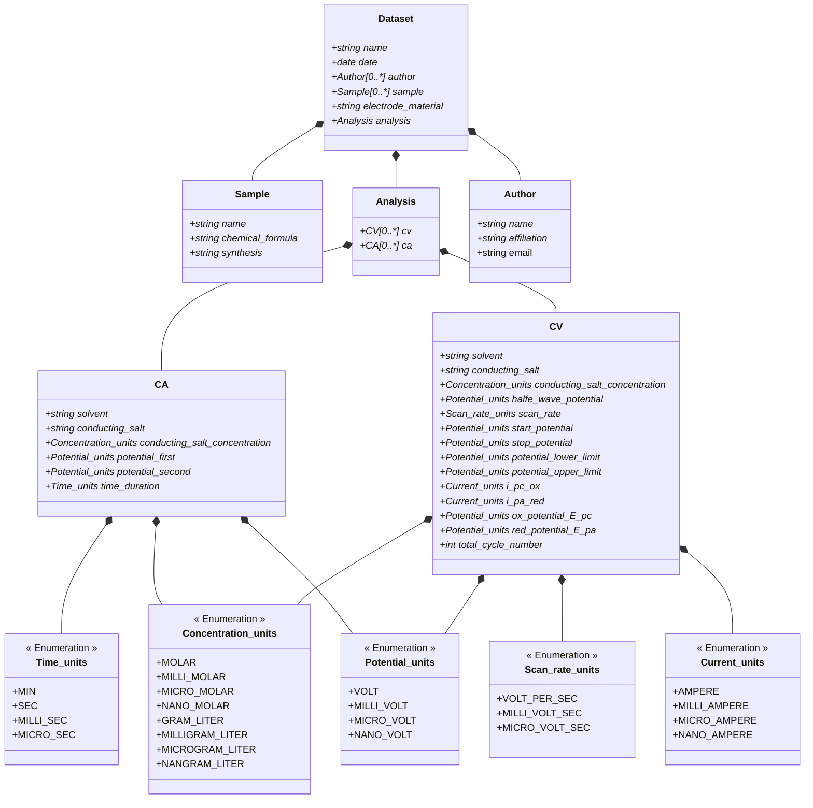

```mermaid
classDiagram
    Dataset *-- Sample
    Dataset *-- Analysis
    Dataset *-- Author
    Analysis *-- CA
    Analysis *-- CV
    CA *-- Time_units
    CA *-- Concentration_units
    CA *-- Potential_units
    CV *-- Concentration_units
    CV *-- Scan_rate_units
    CV *-- Current_units
    CV *-- Potential_units
    
    class Dataset {
        +string name*
        +date date*
        +Author[0..*] author*
        +Sample[0..*] sample*
        +string electrode_material*
        +Analysis analysis*
    }
    
    class Sample {
        +string name*
        +string chemical_formula*
        +string synthesis*
    }
    
    class Analysis {
        +CV[0..*] cv*
        +CA[0..*] ca*
    }
    
    class CA {
        +string solvent*
        +string conducting_salt*
        +Concentration_units conducting_salt_concentration*
        +Potential_units potential_first*
        +Potential_units potential_second*
        +Time_units time_duration*
    }
    
    class CV {
        +string solvent*
        +string conducting_salt*
        +Concentration_units conducting_salt_concentration*
        +Potential_units halfe_wave_potential*
        +Scan_rate_units scan_rate*
        +Potential_units start_potential*
        +Potential_units stop_potential*
        +Potential_units potential_lower_limit*
        +Potential_units potential_upper_limit*
        +Current_units i_pc_ox*
        +Current_units i_pa_red*
        +Potential_units ox_potential_E_pc*
        +Potential_units red_potential_E_pa*
        +int total_cycle_number*
    }
    
    class Author {
        +string name*
        +string affiliation*
        +string email
    }
    
    class Time_units {
        << Enumeration >>
        +MIN
        +SEC
        +MILLI_SEC
        +MICRO_SEC
    }
    
    class Concentration_units {
        << Enumeration >>
        +MOLAR
        +MILLI_MOLAR
        +MICRO_MOLAR
        +NANO_MOLAR
        +GRAM_LITER
        +MILLIGRAM_LITER
        +MICROGRAM_LITER
        +NANGRAM_LITER
    }
    
    class Scan_rate_units {
        << Enumeration >>
        +VOLT_PER_SEC
        +MILLI_VOLT_SEC
        +MICRO_VOLT_SEC
    }
    
    class Current_units {
        << Enumeration >>
        +AMPERE
        +MILLI_AMPERE
        +MICRO_AMPERE
        +NANO_AMPERE
    }
    
    class Potential_units {
        << Enumeration >>
        +VOLT
        +MILLI_VOLT
        +MICRO_VOLT
        +NANO_VOLT
    }
    
```